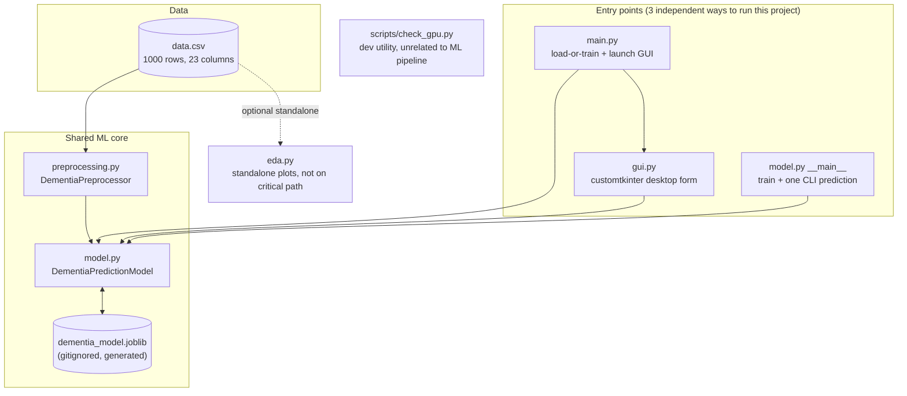
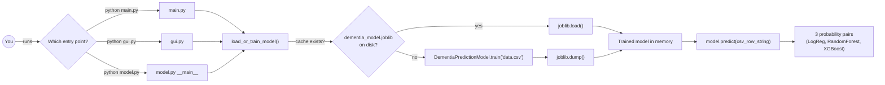
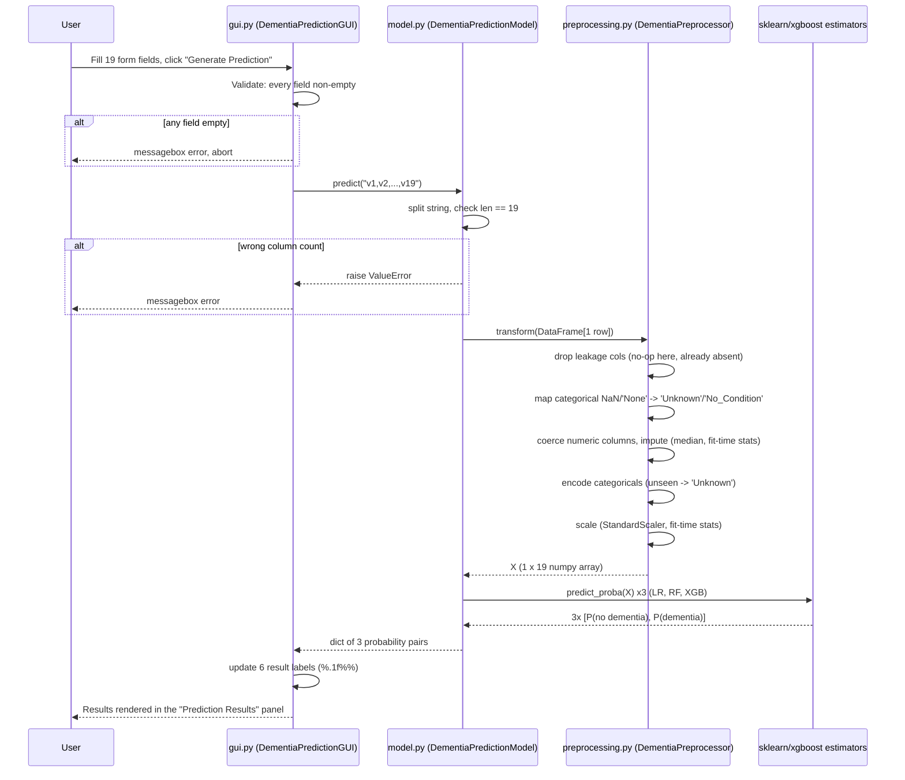
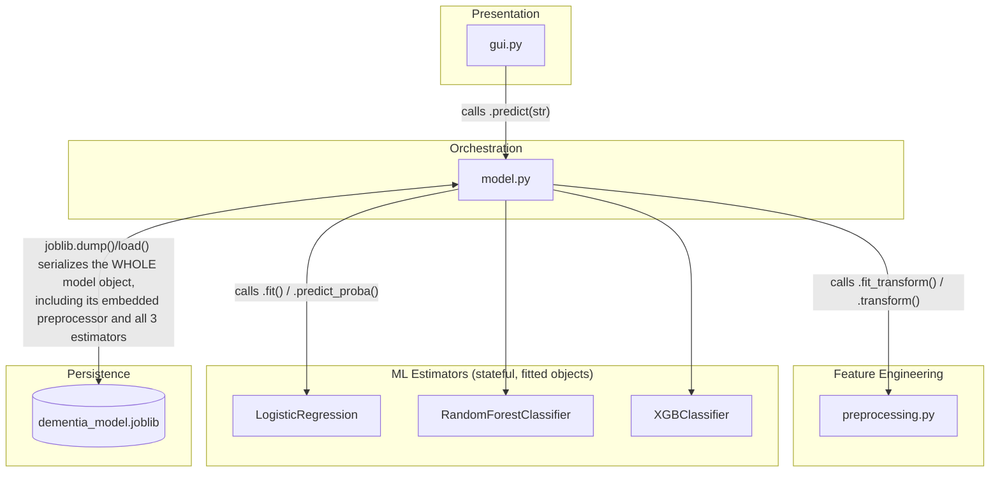
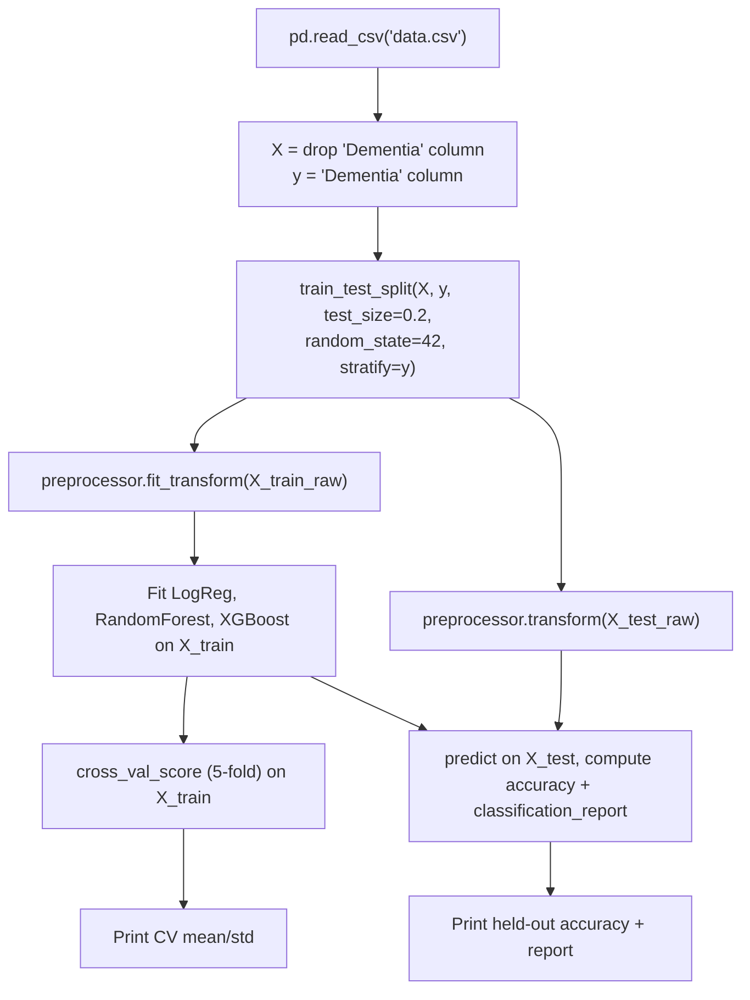
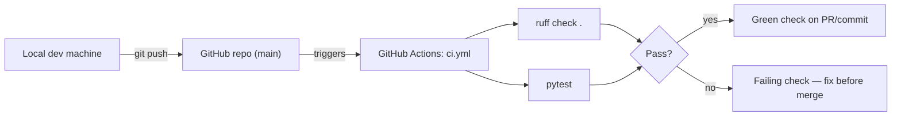
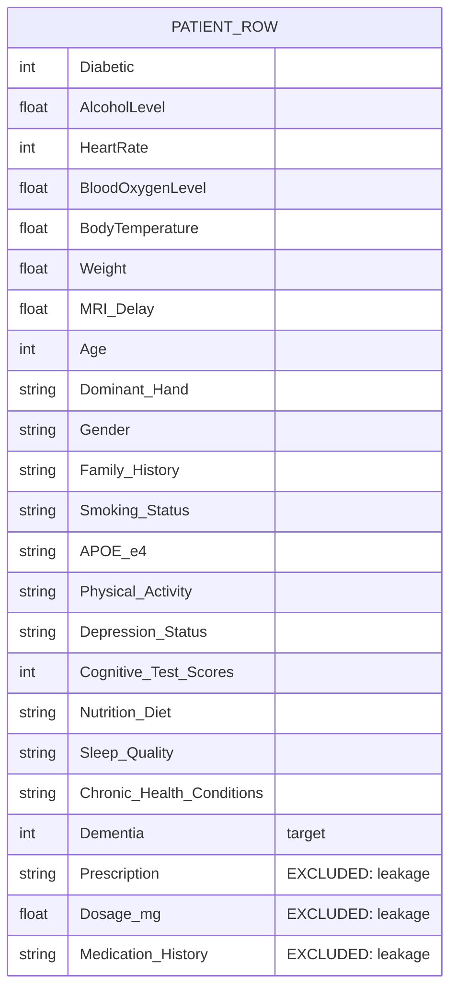

# Dementia Prediction — Engineering Handbook

> **Read this first if you're future-me.** This document is written so you can
> re-load the entire mental model of this project in one sitting, even after
> a year away. It explains *why* things are built the way they are, not just
> *what* the code does. Sections 23–25 are specifically for interviews/demos —
> skip straight there if you just need to talk about this project confidently.

---

## How to use this document

| If you need to... | Go to |
|---|---|
| Remember what this project even is | §1 Project Overview |
| Find a file fast | §2 Folder Structure |
| Understand data flow | §3 System Architecture, §4 Project Flow |
| Debug a specific module | §6 Logic Explanation |
| Explain a design choice you don't remember making | §14 Design Decisions |
| Prep for an interview *tonight* | §23, §24, §25 |
| Just run the thing | §26 |

---

# 1. Project Overview

## 1.1 What problem does this solve?

- This is a **portfolio/learning project**, not a production clinical tool. It
  demonstrates an end-to-end supervised ML workflow: load tabular health
  data → clean/encode it → train multiple classifiers → serve predictions
  through a desktop GUI.
- The "problem" it solves on paper is: *given a patient's vitals, lifestyle,
  and clinical-assessment data, predict whether they have dementia
  (`Dementia` = 0/1).*
- **Assumption:** there is no evidence (no docs, no commit messages) that
  this was built for a real clinical use case. Treat it as a demonstration of
  ML engineering practice (data leakage awareness, train/test hygiene, model
  packaging, GUI integration) rather than a validated diagnostic tool.

## 1.2 Why was this built?

- Most likely purpose: to practice the full loop of tabular ML — EDA →
  preprocessing → multi-model training → evaluation → a usable interface —
  rather than to solve a genuinely hard prediction problem. The dataset
  (`data.csv`) is synthetic (see §9.4) and was probably sourced from a
  Kaggle-style "dementia prediction" toy dataset.
- The GUI (`gui.py`) is disproportionately polished (custom color theme,
  emoji section headers, scrollable form) relative to the ML code, which
  suggests the UI/UX was a deliberate focus — likely for a demo or portfolio
  presentation rather than pure backend work.

## 1.3 Who are the users?

- **You (the developer)** — running scripts locally to train/evaluate models
  or demo the GUI.
- There is no multi-user, networked, or hosted usage. Everything runs on a
  single machine, single process, no accounts, no persistence beyond one
  cached model file.

## 1.4 High-level architecture



- **Why this shape:** the project deliberately separates *feature
  engineering* (`preprocessing.py`) from *model orchestration* (`model.py`)
  from *presentation* (`gui.py`). This was a refactor away from an earlier
  version where all three were tangled inside one class — see §14 for why
  that mattered.

## 1.5 Key features

- Trains **three classifiers simultaneously** (Logistic Regression, Random
  Forest, XGBoost) on the same data and reports all three side by side —
  useful for comparing model behavior, not for picking "the one true model."
- **Leakage-aware feature set**: explicitly excludes columns that are only
  populated after a diagnosis (see §9.4 — this is the single most important
  design decision in the repo).
- **Model caching**: trains once, persists to disk (`joblib`), reloads on
  subsequent runs instead of retraining every launch.
- **Desktop GUI** for interactive single-prediction input, grouped into
  clinically-themed sections (Demographics, Medical History, Vitals,
  Lifestyle, Clinical Assessment).
- **Test suite + CI** (pytest + ruff via GitHub Actions) — added specifically
  to prevent silent regressions in the preprocessing math (see §8, §12).

## 1.6 Tech stack with reasons

| Technology | Why it was chosen | Alternative considered |
|---|---|---|
| Python | Dominant ecosystem for tabular ML (pandas/sklearn/xgboost); GUI+ML in one language keeps the project small | N/A — right default for this scale |
| pandas | Standard tabular data manipulation; needed for CSV I/O, dtype coercion, category cleanup | polars (faster, but ecosystem/GUI glue code is more mature in pandas) |
| scikit-learn | Provides `LabelEncoder`, `StandardScaler`, `SimpleImputer`, `train_test_split`, `LogisticRegression`, `RandomForestClassifier`, `cross_val_score` — the entire preprocessing + 2 of 3 models | Manual implementations — pointless reinvention for a demo project |
| XGBoost | Gradient boosting baseline; industry-standard for tabular classification, complements the two sklearn models | LightGBM/CatBoost — comparable, no strong reason to prefer either here |
| joblib | Persist a trained `DementiaPredictionModel` (a Python object containing fitted sklearn/xgboost estimators) to disk | `pickle` directly — joblib is the sklearn-recommended wrapper, handles numpy arrays more efficiently |
| customtkinter | Themed wrapper over Tkinter; gives a modern-looking desktop GUI with zero extra runtime/install complexity (no browser, no Node) | A web framework (Flask+HTML) — would add a server, ports, and deployment surface for no benefit in a local single-user tool |
| matplotlib + seaborn | Standard EDA plotting | plotly (interactive, but unnecessary for one-off static plots) |
| pytest | Standard Python test runner; fixtures make synthetic-dataset setup easy | unittest — more boilerplate, no compelling reason to use it here |
| ruff | Fast linter for import order and basic correctness (unused vars, etc.) | flake8/pylint — slower, ruff is now the ecosystem default |
| GitHub Actions | Free CI tied directly to the GitHub repo, minimal config | Jenkins/CircleCI — unnecessary infra for a solo project |

---

# 2. Folder Structure

```
Dementia-Prediction/
├── data.csv                    # The only "database" — 1000-row synthetic patient dataset
├── preprocessing.py            # Feature engineering: encode/impute/scale (fit on train, reuse on test/inference)
├── model.py                    # Model orchestration: train/predict/save/load, the "public API"
├── gui.py                      # customtkinter desktop form — the only user-facing surface
├── main.py                     # Real entry point: load-or-train model, then launch GUI
├── eda.py                      # Standalone exploratory analysis (prints stats, shows plots) — NOT on the training/inference path
├── scripts/
│   └── check_gpu.py             # Dev utility: checks CUDA/torch GPU availability — unrelated to the sklearn/xgboost pipeline
├── tests/
│   ├── test_preprocessing.py    # Unit tests for DementiaPreprocessor
│   └── test_model.py            # Unit tests for DementiaPredictionModel (train/predict/save/load)
├── conftest.py                  # Ensures repo root is importable from tests/ (no src-layout, no package)
├── pyproject.toml               # pytest + ruff configuration
├── requirements.txt             # Pinned runtime dependencies
├── requirements-dev.txt         # + pytest, ruff, torch (only for scripts/check_gpu.py)
├── .github/workflows/ci.yml     # Lint + test on every push/PR to main
├── .gitignore                   # __pycache__/, venv/, *.joblib, etc.
├── LICENSE                      # MIT
└── README.md                    # This file
```

### Folder-by-folder rules

| Path | Purpose | Why it exists | What belongs here | What must NEVER go here |
|---|---|---|---|---|
| `/` (root) | Small flat project, no `src/` layout | The whole codebase is 6 files; a package layout would be over-engineering | Top-level scripts, config files | Business logic split across deep subpackages — keep it flat until it's actually too big |
| `scripts/` | Dev-only utilities not part of the ML pipeline | Created specifically to quarantine `check_gpu.py`, which has nothing to do with training/inference | One-off developer utilities (env checks, data-generation helpers) | Anything imported by `model.py`/`gui.py`/`main.py` — if it's on the critical path, it doesn't belong here |
| `tests/` | pytest unit tests | Added because the preprocessing math (imputation, leakage-column dropping, unseen-category handling) is exactly the kind of logic that silently breaks on refactors | One test file per module under test | Fixtures/data generators for manual/EDA use — those belong in `eda.py` or a notebook, not `tests/` |
| `.github/workflows/` | CI definitions | Automates "does it still lint and pass tests" on every push | GitHub Actions YAML | Secrets, deploy credentials — this project has no deployment target |

---

# 3. System Architecture

This project has **no client-server split, no HTTP layer, no database
server, and no auth** — it's a single local Python process. The diagrams
below are adapted from a web-app template to fit what actually exists here;
sections that don't apply (Auth Flow, Deployment Flow as a *server* concept)
are explicitly marked.

## 3.1 Overall Architecture



## 3.2 "Request" Flow (GUI prediction, the closest analog to an API request)



## 3.3 Component Interaction



- **Why this matters:** `joblib.dump(self, path)` in `model.py` serializes the
  *entire* `DementiaPredictionModel` instance — including its
  `DementiaPreprocessor` (with fitted encoders/imputer/scaler) and all three
  fitted estimators — as one object. This means the cache file is a single
  atomic unit: you can't "load a newer model but keep the old preprocessor."
  Deleting `dementia_model.joblib` and rerunning is the correct way to force
  retraining after changing `preprocessing.py` or `data.csv`.

## 3.4 Backend Flow (there is no backend server — this is the closest equivalent: the training pipeline)



## 3.5 Authentication Flow

- **Does not exist in this project.** There are no user accounts, no login
  screen, no tokens, no sessions. The GUI is a single-user local desktop
  form.
- **Assumption:** if this were ever turned into a hosted/multi-user service
  (e.g. a Flask API behind the model), auth would need to be added from
  scratch — nothing here provides a starting point.

## 3.6 Database Flow

- There is no database server. `data.csv` is the entire "database": a flat
  file read once per training run via `pandas.read_csv`.
- No writes ever happen to `data.csv` — it's read-only from the code's
  perspective. The only "write" in the whole system is `joblib.dump()`
  writing the trained model object to `dementia_model.joblib`.
- See §9 for the full schema documentation.

## 3.7 Deployment Flow



- **There is no CD (continuous *deployment*)** — nothing gets deployed
  anywhere. CI here only means "lint + test on every push," not "ship to
  production." Running the app means cloning the repo and executing
  `python main.py` locally (see §18, §26).

---

# 4. Project Flow (complete lifecycle)

```
User runs `python main.py`
    ↓
main.py imports model.load_or_train_model and gui.DementiaPredictionGUI
    ↓
load_or_train_model() checks: does 'dementia_model.joblib' exist on disk?
    ↓                                              ↓
   YES                                             NO
    ↓                                              ↓
joblib.load() deserializes                 DementiaPredictionModel().train('data.csv')
the whole model object                             ↓
    ↓                                      reads CSV, splits, fits
    └──────────────┬───────────────────────preprocessor + 3 models,
                   ↓                        prints CV/test metrics,
           Model object in memory           then joblib.dump()s to disk
           (self.is_trained = True)                 ↓
                   ↓ ←───────────────────────────────┘
customtkinter root window (ctk.CTk()) created
    ↓
DementiaPredictionGUI(root, model=model) builds the form
    ↓
create_widgets() builds 5 sections x 19 fields total,
    plus a "Generate Prediction" button and a results panel
    ↓
Tkinter event loop starts (root.mainloop()) — blocks here until window closed
    ↓
[User fills form, clicks button]
    ↓
make_prediction() (see §3.2 sequence diagram) validates inputs,
    joins them into one comma-separated string,
    calls self.model.predict(input_string)
    ↓
preprocessor.transform() runs the SAME fitted encoders/imputer/scaler
    used during training (this is the critical correctness invariant —
    see §14.2)
    ↓
3 estimators' predict_proba() called, results returned as a dict
    ↓
GUI updates 6 labels (No Dementia % / Dementia % for each of 3 models)
    ↓
User reads results on screen. No data is persisted, logged, or sent anywhere.
```

- **Every transition explained:**
  - *Cache check first*: avoids retraining (which takes several seconds and
    reprints metrics) on every single GUI launch — see §14.3 for why this
    was added.
  - *Train-then-save*: training always saves immediately after, so the next
    launch is fast regardless of whether this run trained or loaded.
  - *Form validation before predict*: prevents sending an incomplete
    19-value string into `predict()`, which would otherwise raise a
    `ValueError` from the column-count check (see §12).
  - *No persistence of predictions*: this is a stateless tool by design —
    there's no audit log, no history, no database write. If you wanted to
    add prediction history, that would be a new feature (see §22).

---

# 5. Code Flow

```
Entry point (main.py / gui.py / model.py __main__)
    ↓
model.load_or_train_model()          [model.py]
    ↓
DementiaPredictionModel.train()      [model.py]  ─── or ───  DementiaPredictionModel.load()  [model.py, via joblib]
    ↓
DementiaPreprocessor.fit_transform() [preprocessing.py]
    ↓
sklearn estimators .fit()            [LogisticRegression / RandomForestClassifier / XGBClassifier]
    ↓
(back in model.py) cross_val_score(), accuracy_score(), classification_report()
    ↓
DementiaPredictionModel.save()       [model.py, via joblib.dump]

--- at prediction time ---

DementiaPredictionGUI.make_prediction() [gui.py]
    ↓
DementiaPredictionModel.predict()    [model.py]
    ↓
DementiaPreprocessor.transform()     [preprocessing.py]
    ↓
sklearn/xgboost estimators .predict_proba()
    ↓
(back in gui.py) update CTkLabel widgets
```

- **Who calls whom (call graph, not just data flow):**

| Caller | Callee | Why |
|---|---|---|
| `main.py::main` | `model.load_or_train_model` | Get a ready model without caring if it was loaded or trained |
| `main.py::main` | `gui.DementiaPredictionGUI.__init__` | Launch the UI with an already-ready model injected (avoids GUI retraining itself) |
| `gui.py::DementiaPredictionGUI.__init__` | `model.load_or_train_model` | Fallback path — only runs if `gui.py` is executed standalone (`python gui.py`), not via `main.py` |
| `gui.py::make_prediction` | `model.DementiaPredictionModel.predict` | The only place the GUI talks to the ML layer |
| `model.py::train` | `preprocessing.DementiaPreprocessor.fit_transform` / `.transform` | Feature engineering is delegated, not inlined |
| `model.py::predict` | `preprocessing.DementiaPreprocessor.transform` | Must reuse the *same fitted* preprocessor — this is why the preprocessor lives on `self` |
| `tests/test_model.py` | `model.DementiaPredictionModel` | Verifies train/predict/save/load roundtrip on a small synthetic CSV |
| `tests/test_preprocessing.py` | `preprocessing.DementiaPreprocessor` | Verifies leakage-column dropping, median imputation, unseen-category handling |

---

# 6. Logic Explanation (per module)

## 6.1 `preprocessing.py` — `DementiaPreprocessor`

- **Purpose:** convert a raw patient-row DataFrame into a clean numeric
  matrix ready for sklearn/xgboost, using statistics learned *only* from
  training data.
- **Inputs:** a pandas DataFrame with the 19 `INPUT_COLUMNS` (plus optionally
  the 3 `LEAKAGE_COLUMNS`, which get silently dropped if present).
- **Outputs:** a `numpy.ndarray` of shape `(n_rows, 19)` — 9 numeric columns
  first, then 10 label-encoded categorical columns, always in that fixed
  order (see §6.1.1 for why this matters).
- **Internal logic (step by step):**
  1. Drop `LEAKAGE_COLUMNS` if present (`if c in data.columns` guard — safe
     to call on data that never had them, like GUI input).
  2. On the **first** call only (`fit` or `transform`), lock in
     `self.numerical_columns` = every column not in `CATEGORICAL_COLUMNS`.
     This is a **stateful side effect on first use** — see edge case below.
  3. Replace `'None'`/`'none'`/`NaN` in categorical columns with
     `'No_Condition'` / `'Unknown'` respectively.
  4. Coerce numeric columns via `pd.to_numeric(errors='coerce')` — bad
     values become `NaN`, not a crash.
  5. **If fitting:** for each categorical column, collect the unique string
     values seen, add a synthetic `'Unknown'` category, fit a
     `LabelEncoder` on that vocabulary, and remember the vocabulary in
     `self.category_mappings`.
     **If transforming:** any category value not in the remembered
     vocabulary gets remapped to `'Unknown'` before encoding — this is what
     prevents a crash on an unseen category at inference time.
  6. Assemble the final column order: `numerical_columns + CATEGORICAL_COLUMNS`.
  7. **If fitting:** impute numeric columns with the **median** (not 0 — see
     §14.5 for why this was changed), then fit+apply a `StandardScaler`
     across *all* columns (numeric + already-integer-encoded categorical).
     **If transforming:** apply the already-fitted imputer/scaler
     (`.transform`, never `.fit_transform`).
- **Edge cases:**
  - Calling `.transform()` before `.fit_transform()` raises `RuntimeError`
    (explicit guard) instead of an obscure `AttributeError` deep in sklearn.
  - An unseen categorical value at inference time is mapped to `'Unknown'`
    — as long as `'Unknown'` was in the fit-time vocabulary (it always is,
    it's added unconditionally in step 5).
  - **Known assumption/limitation:** `self.numerical_columns` is captured
    from whatever DataFrame is passed to the *first* `fit_transform`/`transform`
    call and never recomputed. If a future caller passes a DataFrame with a
    different column set (e.g., a new numeric column added to `data.csv`
    without updating `INPUT_COLUMNS`), the column mismatch would surface as
    a `KeyError` on `data[self.feature_columns]`, not a silent bug — but it's
    worth knowing this isn't re-validated per call.
- **Time complexity:** O(n_rows × n_columns) for all pandas operations —
  linear, no nested loops over rows.
- **Space complexity:** O(n_rows × n_columns) — one full copy of the input
  DataFrame plus the derived numpy matrix.
- **Common mistakes this code prevents (by construction):**
  - Fitting the scaler/imputer on the full dataset before splitting
    (leakage) — impossible here because `fit_transform` and `transform` are
    separate methods and `model.py` calls them on separate splits.
  - Crashing on a category never seen during training.
- **Future improvements:** persist `category_mappings`/scaler stats to a
  human-readable format (e.g. JSON) alongside the joblib blob for easier
  debugging without deserializing the whole model.

## 6.2 `model.py` — `DementiaPredictionModel`

- **Purpose:** own the full train → evaluate → predict → persist lifecycle
  for all three classifiers as one unit.
- **Inputs:** `train(data_path, test_size=0.2, cv_folds=5)` takes a CSV path;
  `predict(input_data_str)` takes one comma-joined row string.
- **Outputs:** `train()` prints metrics (no return value); `predict()`
  returns `{"Logistic Regression": [p0, p1], "Random Forest": [...],
  "XGBoost": [...]}`.
- **Internal logic:** see §3.4 (training) and §3.2 (prediction) diagrams —
  not repeated here.
- **Edge cases:**
  - `predict()` before `train()`/`load()` raises `RuntimeError` (checks
    `self.is_trained`).
  - Wrong number of comma-separated values raises `ValueError` with the
    expected column list in the message (so the caller can actually fix
    their input, unlike the old version which silently returned `None`).
  - `save()` on an untrained model raises `RuntimeError` rather than
    silently writing a broken cache file.
- **Time complexity:** dominated by `RandomForestClassifier`/`XGBClassifier`
  fitting — roughly O(n_estimators × n_rows × log(n_rows) × n_features) for
  tree ensembles; Logistic Regression is near-linear. For 1000 rows this is
  sub-second.
- **Common mistakes prevented:** the old code fit preprocessing before
  splitting (leakage) and used `use_label_encoder=False` (a removed
  XGBoost param that only produced a warning, silently doing nothing).
- **Future improvements:** hyperparameter tuning (currently all three models
  use fixed/default hyperparameters plus a seed); model versioning (the
  joblib cache has no version tag — changing `preprocessing.py` and
  forgetting to delete the cache will silently serve stale logic wrapped
  around new code, see §21).

## 6.3 `gui.py` — `DementiaPredictionGUI`

- **Purpose:** the only human-facing surface. Renders a scrollable form
  grouped into 5 clinically-themed sections, collects exactly the 19
  `INPUT_COLUMNS` values, and displays 3 models' probability outputs.
- **Inputs:** a Tkinter `root` window, optionally a pre-built `model`
  (dependency injection — see §14.6 for why).
- **Outputs:** none programmatically — output is visual (label text updates).
- **Internal logic:** `create_widgets()` builds the whole form once at
  startup (`sections` dict defines field names + optional dropdown values —
  `None` means free-text `CTkEntry`, a list means `CTkComboBox`).
  `make_prediction()` is the button callback: validates non-empty, joins
  into a CSV-row string in `INPUT_COLUMNS` order (imported from `model.py`,
  not duplicated — this was a deliberate fix, see §14.7), calls
  `model.predict()`, updates labels.
- **Edge cases:** any empty field aborts with a `messagebox.showerror`
  before calling `predict()` at all — client-side validation avoids a wasted
  round-trip.
- **Common mistakes prevented:** the field list used to be duplicated between
  the form-builder and the submit handler (two separate hardcoded lists) —
  now both derive from the single `INPUT_COLUMNS` source of truth in
  `model.py`.
- **Future improvements:** the `canvas`/`scrollbar` manual scroll
  implementation could be replaced with `customtkinter`'s built-in
  `CTkScrollableFrame` for less boilerplate.

## 6.4 `main.py`

- **Purpose:** the actual "run the project" entry point — didn't exist
  before the refactor (the old `main.py` was actually an EDA script; see
  §14.8).
- **Logic:** `load_or_train_model()` then construct `ctk.CTk()` +
  `DementiaPredictionGUI(root, model=model)` then `root.mainloop()`.
- **What breaks if removed:** nothing structurally — `gui.py` can still run
  standalone (`python gui.py`) because it has its own fallback
  `load_or_train_model()` call. `main.py` exists purely for discoverability
  ("what do I run?").

## 6.5 `eda.py`

- **Purpose:** one-off descriptive statistics + 3 plots (gender pie chart,
  age-vs-dementia countplot, dementia-vs-gender countplot) plus a smoking
  status value-count print.
- **Not on the training/inference path** — nothing imports this file.
- **Note:** its own `ffill()` missing-value handling is intentionally
  different from `preprocessing.py`'s median/mode-aware handling — this
  script is for eyeballing the raw data, not for feeding a model.

## 6.6 `scripts/check_gpu.py`

- **Purpose:** confirm whether a CUDA-capable `torch` install can see a GPU.
- **Completely unrelated** to the sklearn/xgboost training pipeline — `torch`
  is not a runtime dependency of `model.py`/`preprocessing.py`/`gui.py`.
  **Assumption:** this was probably left over from an earlier experiment
  (maybe evaluating a neural-net approach) that was abandoned in favor of
  the current sklearn/xgboost pipeline.

---

# 7. Feature Breakdown

## 7.1 Feature: Multi-model training & comparison

- **Why it exists:** compare a linear model, a bagged tree ensemble, and a
  boosted tree ensemble on identical data/splits — useful for learning how
  different model families behave, not for picking a production model.
- **Files involved:** `model.py` (`train`), `preprocessing.py`.
- **Execution flow:** see §3.4.
- **"API" calls:** none (no network) — direct Python method calls.
- **Database changes:** none (`data.csv` is read-only).
- **UI updates:** none — this path is CLI/console-only (`print` statements).
- **Validation:** stratified split ensures both classes appear in
  train/test; leakage columns removed before any fitting.
- **Error handling:** none needed here today — a malformed CSV would
  surface as a pandas/sklearn exception (not swallowed).

## 7.2 Feature: Interactive GUI prediction

- **Why it exists:** the human-usable surface — lets you type in one
  patient's data and see all 3 models' opinions instantly instead of editing
  a Python string in `model.py`.
- **Files involved:** `gui.py`, `model.py`.
- **Execution flow:** see §3.2 sequence diagram.
- **Validation:** every one of 19 fields must be non-empty before submit;
  `model.predict()` re-validates column count.
- **Error handling:** `messagebox.showerror` for both empty fields and any
  exception raised during prediction (caught at the UI boundary, not inside
  `predict()` itself — see §12).

## 7.3 Feature: Model caching (load-or-train)

- **Why it exists:** training 3 models every GUI launch (even at ~1 second)
  is wasteful and blocks the Tkinter window from appearing. Cache once,
  reuse until you intentionally delete `dementia_model.joblib`.
- **Files involved:** `model.py::load_or_train_model`.
- **Execution flow:** see §4.
- **"Database" changes:** writes one file, `dementia_model.joblib` (git-ignored).
- **Error handling:** none explicit — if the joblib file is corrupt,
  `joblib.load()` raises and the caller (`main.py`/`gui.py`) currently lets
  it propagate as an uncaught exception in `main.py`, or a `messagebox`
  error in the `gui.py` standalone fallback path.

---

# 8. API Documentation

There is **no REST/HTTP API** in this project. The closest equivalent is the
**public Python interface** of `DementiaPredictionModel` — this is what
every "consumer" (`gui.py`, tests, a future script) actually calls.

| Method | Purpose | Input | Output | Validation | Errors raised | Example |
|---|---|---|---|---|---|---|
| `DementiaPredictionModel()` | Construct an untrained model (fresh preprocessor + 3 unfitted estimators) | none | instance | — | — | `model = DementiaPredictionModel()` |
| `.train(data_path, test_size=0.2, cv_folds=5)` | Load CSV, split, fit preprocessor + 3 models, print CV + held-out metrics | `data_path: str`, optional `test_size`, `cv_folds` | `None` (side effect: `self.is_trained = True`) | Requires a `Dementia` column and all `INPUT_COLUMNS` + optionally `LEAKAGE_COLUMNS` in the CSV | Propagates pandas/sklearn errors on malformed CSV | `model.train('data.csv')` |
| `.predict(input_data_str)` | Run inference for one row | Comma-joined string of 19 values, in `INPUT_COLUMNS` order | `dict[str, np.ndarray]` — 3 entries, each `[P(no dementia), P(dementia)]` | Column count must equal `len(INPUT_COLUMNS)`; must be trained first | `RuntimeError` if not trained; `ValueError` if wrong column count | `model.predict("0,0.01,84,99.8,36.0,84.8,38.7,49,Right,Female,No,Never Smoked,Negative,Mild Activity,No,10,Low-Carb Diet,Good,None")` |
| `.save(path='dementia_model.joblib')` | Serialize the whole model object | file path | `None` | Must be trained | `RuntimeError` if not trained | `model.save()` |
| `DementiaPredictionModel.load(path='dementia_model.joblib')` | Deserialize a previously saved model | file path | `DementiaPredictionModel` instance | File must exist and be a valid joblib pickle | Propagates `FileNotFoundError`/`joblib` errors | `model = DementiaPredictionModel.load()` |
| `load_or_train_model(data_path='data.csv', model_path=...)` | Convenience wrapper: load if cached, else train+save | both optional | `DementiaPredictionModel` | — | Propagates whichever of the above two paths fails | `model = load_or_train_model()` |

- **"Authentication":** none — any local process can call any method.
- **"Business logic":** entirely inside `train`/`predict`, delegated to
  `preprocessing.py` for feature engineering (§6.1).

---

# 9. Database Documentation

## 9.1 "Tables"

There is exactly one: `data.csv`. No relational database, no ORM, no
migrations.

## 9.2 Schema

| Column | Type | Role | Notes |
|---|---|---|---|
| `Diabetic` | int (0/1) | feature | |
| `AlcoholLevel` | float | feature | |
| `HeartRate` | int | feature | |
| `BloodOxygenLevel` | float | feature | |
| `BodyTemperature` | float | feature | |
| `Weight` | float | feature | |
| `MRI_Delay` | float | feature | |
| `Prescription` | string/NaN | **excluded (leakage)** | Donepezil/Memantine/Rivastigmine/Galantamine or empty |
| `Dosage in mg` | float/NaN | **excluded (leakage)** | Only present when `Prescription` is present |
| `Age` | int | feature | |
| `Dominant_Hand` | categorical | feature | Left/Right |
| `Gender` | categorical | feature | Male/Female |
| `Family_History` | categorical | feature | Yes/No |
| `Smoking_Status` | categorical | feature | Never/Former/Current Smoker |
| `APOE_ε4` | categorical | feature | Positive/Negative — genetic Alzheimer's risk marker |
| `Physical_Activity` | categorical | feature | Sedentary/Mild/Moderate/High Activity |
| `Depression_Status` | categorical | feature | Yes/No |
| `Cognitive_Test_Scores` | int (0-10) | feature | See §9.4 — near-perfectly separates the target |
| `Medication_History` | categorical | **excluded (leakage)** | Yes/No |
| `Nutrition_Diet` | categorical | feature | Balanced/Low-Carb/Mediterranean/Other |
| `Sleep_Quality` | categorical | feature | Good/Fair/Poor |
| `Chronic_Health_Conditions` | categorical | feature | None/Heart Disease/Diabetes/Hypertension |
| `Dementia` | int (0/1) | **target** | 515 rows = 0, 485 rows = 1 (near-balanced) |

- 1000 rows total, no missing `Dementia` values.
- `Prescription`/`Dosage in mg` are `NaN` for exactly the rows where
  `Dementia == 0` (515 rows) and populated for all `Dementia == 1` rows (485
  rows) — a perfect 1:1 correspondence (verified directly against the CSV).

## 9.3 Relationships / Indexes / Constraints / Foreign Keys

- **None** — it's a single flat CSV, no relational structure at all.

## 9.4 ER Diagram



- Single "entity," no relationships to diagram — included for template
  completeness only.

## 9.5 Why the schema (and the feature exclusions) is designed this way

- **This is the single most important thing to remember about this project.**
  `Prescription`, `Dosage in mg`, and `Medication_History` are only ever
  populated for patients *already on anti-dementia medication* — which
  presupposes they're already diagnosed. Training on them makes the
  "prediction" task trivial and clinically meaningless (predicting a
  diagnosis from a proxy for the diagnosis itself). This is why
  `preprocessing.py::LEAKAGE_COLUMNS` exists and why `model.py::INPUT_COLUMNS`
  excludes them entirely.
- **A second, subtler finding** (discovered by re-running the training
  pipeline after the leakage fix and getting suspiciously high accuracy
  again): `Cognitive_Test_Scores`, `Depression_Status`, and `Smoking_Status`
  are each **individually near-perfect predictors** in this specific
  dataset:
  - Every row with `Cognitive_Test_Scores <= 7` has `Dementia = 1`; every row
    with a score `>= 8` has `Dementia = 0` (a hard threshold, not noisy
    correlation).
  - Every `Depression_Status = Yes` row has `Dementia = 1`.
  - Every `Smoking_Status = Current Smoker` row has `Dementia = 0` (90/90 rows).
  - These were **kept** as features (unlike the medication columns) because
    they're plausibly knowable *before* a diagnosis — but their presence
    means this dataset was generated with injected deterministic rules
    rather than sampled with realistic clinical noise. **Do not read the
    ~99-100% accuracy this pipeline reports as evidence of a good model** —
    it's evidence the model correctly learned this toy dataset's built-in
    rules. See the README caveat and `data.csv`'s synthetic nature.

---

# 10. State Management

- **No frontend framework state (no Redux/Zustand/Context)** — this is a
  Tkinter desktop app, not a web SPA.
- **Widget state:** `self.inputs` (a dict of field name → `CTkEntry`/
  `CTkComboBox` widget) holds the live form state; Tkinter widgets own their
  own text natively, there's no separate state store to keep in sync.
- **Application state:** `self.model` on `DementiaPredictionGUI` holds the
  one piece of state that matters — a trained `DementiaPredictionModel`
  instance, injected at construction or built lazily.
- **"Cache" layer:** `dementia_model.joblib` on disk is the only persistent
  state across process runs. There is no in-memory cache beyond the single
  loaded model object (no LRU cache, no Redis, nothing to reason about
  there).
- **Why this approach:** for a single-user, single-window desktop tool,
  Tkinter's native widget state + one plain Python object is the simplest
  thing that works. Introducing a state-management library here would be
  pure over-engineering.

---

# 11. Authentication & Authorization

- **Does not apply.** No login flow, no tokens, no sessions, no roles, no
  protected routes — there are no "routes" at all.
- If you ever need to answer "how would you add auth to this," the honest
  answer is: this project would need to become a client-server app first
  (e.g., wrap `DementiaPredictionModel` behind a Flask/FastAPI endpoint),
  and only then would auth (JWT/session cookies) become a meaningful
  concept.

---

# 12. Error Handling

| Layer | Strategy | Why |
|---|---|---|
| `preprocessing.py` | Explicit `RuntimeError` if `.transform()` called before `.fit_transform()` | Fail loudly and specifically instead of a confusing sklearn `NotFittedError` several calls deep |
| `model.py::predict` | `RuntimeError` if not trained; `ValueError` with the full expected column list if the input string has the wrong number of values | These are **not caught internally** — they propagate to the caller on purpose, so the caller (GUI, tests, CLI) decides how to present the failure |
| `model.py::save` | `RuntimeError` if called on an untrained model | Prevents silently caching a useless (unfitted) model object |
| `gui.py::make_prediction` | Broad `try/except Exception` around the whole prediction flow, shown via `messagebox.showerror` | **This is the one place a broad catch is correct** — it's the outermost UI boundary; the user needs *some* readable message no matter what went wrong underneath |
| `gui.py::__init__` (standalone fallback only) | `try/except` around `load_or_train_model()`, shows a messagebox, then **re-raises** | Surfacing a broken model state via a silent, half-initialized GUI would be worse than crashing with a clear message |
| CSV read / malformed data | **Not caught anywhere** — a bad path or malformed CSV raises pandas' own `FileNotFoundError`/`ParserError` | Intentional: there's no meaningful fallback for "the training data doesn't exist," so let it fail visibly |

- **No retry logic anywhere** — this is a local, synchronous, single-shot
  tool; there's no network call to retry.
- **No logging framework** — `print()` is used for training metrics (console
  output only). If this project grew, replacing `print` with the `logging`
  module would be a reasonable next step (see §22).
- **Design principle applied throughout the refactor:** *catch broadly only
  at the outermost UI boundary; let internal layers raise specific
  exceptions.* The original code did the opposite (broad `except Exception`
  inside `predict()` itself, swallowing real bugs as `print` + `return
  None`) — this was deliberately fixed.

---

# 13. Important Algorithms

There's no hand-rolled ML algorithm here (all three models are
off-the-shelf sklearn/xgboost) — the one piece of custom logic worth
walking through as "the algorithm" of this project is the **preprocessing
pipeline**, since it's the part most likely to have subtle bugs.

- **Purpose:** turn a raw DataFrame into a fully numeric, fixed-column-order
  matrix, using train-time-only statistics, robust to unseen categories at
  inference time.
- **Pseudocode:**
  ```
  function process(data, fit):
      data = drop(data, LEAKAGE_COLUMNS)
      if numerical_columns is unset:
          numerical_columns = columns(data) - CATEGORICAL_COLUMNS

      for col in CATEGORICAL_COLUMNS:
          data[col] = replace('None'/'none'/NaN -> 'No_Condition'/'Unknown')

      data[numerical_columns] = to_numeric(data[numerical_columns], errors=coerce)

      if fit:
          for col in CATEGORICAL_COLUMNS:
              vocab = unique(data[col]) + {'Unknown'}
              category_mappings[col] = vocab
              label_encoders[col] = fit LabelEncoder on vocab
              data[col] = label_encoders[col].transform(data[col])
      else:
          for col in CATEGORICAL_COLUMNS:
              data[col] = replace_unseen_values_with('Unknown')
              data[col] = label_encoders[col].transform(data[col])

      feature_columns = numerical_columns + CATEGORICAL_COLUMNS
      X = data[feature_columns] as float matrix

      if fit:
          X[:, numeric_idx] = numeric_imputer.fit_transform(X[:, numeric_idx])   # median strategy
          X = scaler.fit_transform(X)
      else:
          X[:, numeric_idx] = numeric_imputer.transform(X[:, numeric_idx])
          X = scaler.transform(X)

      return X
  ```
- **Complexity:** O(rows × columns), no per-row Python loops (everything is
  vectorized pandas/numpy/sklearn operations).
- **Reasoning:** the fit/transform split mirrors sklearn's own convention
  deliberately, so that `DementiaPreprocessor` composes naturally into the
  rest of the sklearn-flavored codebase (`model.py` calls it exactly like it
  would call a `ColumnTransformer`).

---

# 14. Design Decisions

| # | Decision | Why | Pros | Cons | Alternative considered |
|---|---|---|---|---|---|
| 14.1 | Exclude `Prescription`/`Dosage in mg`/`Medication_History` as features | They perfectly encode the target and are only known post-diagnosis (see §9.5) | Model now reflects a plausible pre-diagnosis prediction task | Loses 3 columns' worth of (fake) signal; accuracy drops from the old, meaningless 100% | Keep the columns but document them as leakage — rejected because it's too easy to forget and re-introduce the bug |
| 14.2 | Split train/test **before** fitting the preprocessor | Fitting the scaler/imputer/encoders on the full dataset lets test-set statistics leak into training | Correct, standard-practice evaluation | Slightly more code (two calls, `fit_transform` vs `transform`) | Fit on everything, split after — this was the *original* (buggy) approach; rejected |
| 14.3 | Cache the trained model to disk via joblib | Retraining 3 models on every GUI launch is wasteful and slow | Fast subsequent launches; `main.py`/`gui.py` share one cache | Cache can go stale relative to code changes (see §21) — no versioning built in | In-memory-only (no cache) — rejected, makes every launch pay the training cost |
| 14.4 | One `DementiaPreprocessor` class shared by train and predict paths | Original code had preprocessing logic embedded directly inside `DementiaPredictionModel`, mixing concerns | Testable in isolation (`tests/test_preprocessing.py`); single source of truth for feature engineering | One more file/import to keep track of | Keep preprocessing inline in `model.py` — rejected for testability |
| 14.5 | Median imputation for numeric columns (not constant 0) | Filling missing `HeartRate`/`BodyTemperature` with 0 is physiologically nonsensical and corrupts the scaler's fitted mean/std | Imputed values are plausible, don't skew scaling | Median must be computed at fit time and reused — slightly more state to carry | Constant-fill 0 — this was the *original* (buggy) approach; rejected |
| 14.6 | `DementiaPredictionGUI.__init__(root, model=None)` accepts an optional pre-built model | Lets `main.py` build the model once and inject it, while `gui.py` still works standalone for direct testing/demo | No duplicate training when launched via `main.py`; GUI still independently runnable | One extra parameter, one extra branch in `__init__` | Always self-train inside the GUI — rejected, that's what caused the retrain-on-every-launch problem in the first place |
| 14.7 | `INPUT_COLUMNS` defined once in `model.py`, imported by `gui.py` | The original code hardcoded the same 22-column list in **three places** (`model.py` twice, `gui.py` once) — any schema change had to be made in sync manually | Single source of truth; GUI and model can never drift apart on column order | None significant | Keep duplicated lists — rejected, this is exactly the kind of silent-drift bug worth eliminating |
| 14.8 | Renamed old `main.py` → `eda.py`, old `graphics.py` → `scripts/check_gpu.py`, wrote a *new* `main.py` as the real entry point | File names didn't match contents (`main.py` was actually EDA, `graphics.py` was a CUDA check) — confusing for anyone (including future-you) trying to find "the" entry point | Obvious now what `python main.py` does | One-time churn (git history shows renames) | Leave names as-is and just document the mismatch — rejected, renaming is a permanent fix, a README note is not |
| 14.9 | Three classifiers trained and shown side by side, no single "winner" selected | This is an exploratory/demo project, not a production system that needs to commit to one model | Easy to compare model behavior | No actual model-selection logic exists — if you wanted "the best model," you'd have to add that yourself | Pick the best by CV score and only expose that one — not implemented; a reasonable future improvement (§22) |

---

# 15. Performance Optimizations

Most of the template's usual list (lazy loading, pagination, virtualization,
debouncing/throttling, compression) **does not apply** — there's no network,
no large lists to render, no user typing to debounce. What actually applies:

| Optimization | Where | Why |
|---|---|---|
| Model caching (joblib) | `model.py::load_or_train_model` | Avoids retraining 3 models (seconds of CPU work) on every process launch |
| Vectorized pandas/numpy ops | `preprocessing.py` | All column transforms are vectorized (`.apply`, boolean masks, `.replace`) — no per-row Python loops, which would be O(rows) slower in practice |
| `n_estimators=100` (not higher) for Random Forest | `model.py` | Default-ish tree count; not tuned for accuracy vs. speed trade-off — flagged as a future improvement, not a deliberate optimization |
| Stratified split | `model.py::train` | Not a performance optimization but worth noting here: ensures both classes are represented in train/test without needing oversampling |

- **What's explicitly NOT optimized (and why that's fine at this scale):**
  1000 rows and 3 models fit in well under a second combined — there is no
  performance problem to solve yet. Premature optimization here would be
  wasted effort.

---

# 16. Security

| Concern | Status | Notes |
|---|---|---|
| Authentication/Authorization | N/A | No users, no network exposure |
| Input validation | Present | GUI checks non-empty fields; `model.predict()` validates column count; `preprocessing.py` coerces bad numeric values to `NaN` (then imputed) rather than crashing |
| SQL injection | N/A | No SQL, no database server |
| XSS/CSRF | N/A | No web frontend, no HTTP requests |
| Secrets management | N/A | No API keys, no credentials anywhere in the repo (verified — none found in any tracked file) |
| Environment variables | None used | See §17 |
| Rate limiting | N/A | Single local process, no server |
| Encryption | N/A | No data in transit, no data at rest beyond a local joblib file (which is *not* encrypted — if `data.csv` ever contained real patient data, this would need to change, but it's synthetic) |
| Dependency pinning | Present | `requirements.txt` pins exact versions (see §17) to avoid silent breakage from upstream releases |

- **The one real "security" consideration:** if this project's data source
  were ever swapped for real patient data, `data.csv` and
  `dementia_model.joblib` would both need to be treated as PHI (protected
  health information) — kept out of git, encrypted at rest, access
  controlled. Today, neither applies because the data is synthetic.

---

# 17. Configuration

There is no `.env` file and no environment-variable-based configuration in
this project. "Configuration" here means the handful of constants defined
directly in source:

| Constant | File | Purpose | Default | Required? |
|---|---|---|---|---|
| `DEFAULT_MODEL_PATH` | `model.py` | Where the trained model cache is read/written | `'dementia_model.joblib'` | No — has a default, override by passing `model_path=` to `load_or_train_model`/`save`/`load` |
| `RANDOM_STATE` | `model.py` | Seed for `train_test_split`, `LogisticRegression`, `RandomForestClassifier`, `XGBClassifier` | `42` | No — hardcoded for reproducibility; change only if you deliberately want different splits/results |
| `INPUT_COLUMNS` | `model.py` | The exact 19 columns (and order) `predict()` expects | fixed list | Yes, implicitly — both `gui.py` and any script calling `predict()` must match this |
| `DATA_PATH` | `eda.py` | CSV path for the standalone EDA script | `'data.csv'` | No |
| `CATEGORICAL_COLUMNS` / `LEAKAGE_COLUMNS` | `preprocessing.py` | Schema knowledge — which columns are categorical vs. excluded | fixed lists | Yes, implicitly — must match `data.csv`'s actual columns |

- **Why no `.env`:** there's genuinely nothing that varies by environment
  (no API keys, no DB connection strings, no per-environment URLs) — adding
  a `.env` here would be configuration for its own sake.

---

# 18. Deployment

- **Build process:** none — this is interpreted Python, no compilation/bundling step.
- **Environments:** one — your local machine. No staging/production split exists.
- **CI/CD:** GitHub Actions (`.github/workflows/ci.yml`) runs on every push/PR
  to `main`: install `requirements.txt`, `ruff check .`, `pytest`. This is
  **CI only** — nothing gets deployed as a result of a green build.
- **Docker:** not present. Given the GUI depends on a local display (Tkinter),
  containerizing it would require X11 forwarding or a VNC setup — not worth
  it for a local desktop tool. If this were ever turned into a headless
  service (e.g. a Flask API around `DementiaPredictionModel`), Docker would
  make more sense then.
- **Cloud:** none — nothing is hosted anywhere.
- **"Production architecture" / scaling:** does not apply at this project's
  current scope. If you ever needed to scale this (e.g., serve predictions
  to many users), the real architectural change would be: wrap
  `DementiaPredictionModel.predict()` behind an HTTP endpoint, drop Tkinter
  entirely, and move the model artifact to a shared location (S3, etc.)
  instead of a local file — a substantial rewrite, not a config change.

---

# 19. Complete File Explanation

| File | Purpose | Who imports it | Who calls it | Depends on | What breaks if removed |
|---|---|---|---|---|---|
| `data.csv` | The dataset | `model.py::train`, `eda.py::run` (via `pd.read_csv`) | N/A (data, not code) | — | `train()`/`load_or_train_model()` (first run) and `eda.py` would fail with `FileNotFoundError`; a cached `dementia_model.joblib` would still work without it |
| `preprocessing.py` | Feature engineering | `model.py` | `model.py::DementiaPredictionModel.train/predict` | numpy, pandas, sklearn | `model.py` fails to import; nothing works |
| `model.py` | Model orchestration + public "API" | `gui.py`, `main.py`, `tests/test_model.py` | `gui.py::make_prediction`, `main.py::main` | `preprocessing.py`, joblib, pandas, sklearn, xgboost | `gui.py` and `main.py` fail to import; entire project non-functional |
| `gui.py` | Desktop UI | `main.py` | User (via `python gui.py`) or `main.py` | `model.py`, customtkinter | Loses the only user-facing interface; `model.py` still usable from a script/REPL |
| `main.py` | Entry point | Nobody (it's the top) | User (`python main.py`) | `model.py`, `gui.py`, customtkinter | Loses the "obvious" way to run the project; `python gui.py` still works as a fallback |
| `eda.py` | Standalone analysis | Nobody | User (`python eda.py`) | pandas, matplotlib, seaborn | No effect on training/inference — purely descriptive |
| `scripts/check_gpu.py` | GPU dev check | Nobody | User (`python scripts/check_gpu.py`) | torch (optional, dev-only) | No effect on anything — fully isolated |
| `tests/test_preprocessing.py` | Unit tests | pytest (auto-discovered) | CI (`ruff`+`pytest` job) | `preprocessing.py`, pytest | Loses regression protection for the feature-engineering math |
| `tests/test_model.py` | Unit tests | pytest (auto-discovered) | CI | `model.py`, pytest | Loses regression protection for train/predict/save/load |
| `conftest.py` | Makes repo root importable in tests | pytest (auto-discovered) | pytest, implicitly | — | Test imports (`from model import ...`) would fail with `ModuleNotFoundError` when run from certain working directories |
| `pyproject.toml` | pytest + ruff config | pytest, ruff (auto-discovered) | CI | — | Tests/lint would still run but with default (less intentional) settings |
| `requirements.txt` | Pinned runtime deps | pip | Anyone setting up the project, CI | — | New installs could pull incompatible newer library versions |
| `requirements-dev.txt` | + pytest/ruff/torch | pip | Contributors running tests/lint locally | `requirements.txt` | Dev tooling not installed by default |
| `.github/workflows/ci.yml` | CI pipeline | GitHub Actions | Every push/PR | `requirements.txt` | No automated lint/test feedback on future changes |

---

# 20. End-to-End Execution Walkthrough

**Scenario: user launches the app and gets a prediction via the GUI.**

```
1. User runs: python main.py
       ↓
2. Python imports model.py, gui.py (which itself imports model.py — already cached by Python's import system)
       ↓
3. main() calls load_or_train_model()
       ↓
4. os.path.exists('dementia_model.joblib') → False (first run)
       ↓
5. DementiaPredictionModel() constructed: fresh DementiaPreprocessor,
   fresh LogisticRegression/RandomForestClassifier/XGBClassifier, is_trained=False
       ↓
6. model.train('data.csv'):
   a. pandas reads data.csv into a 1000x23 DataFrame
   b. X = all columns except Dementia; y = Dementia
   c. train_test_split (80/20, stratified, seed=42) → X_train_raw, X_test_raw, y_train, y_test
   d. preprocessor.fit_transform(X_train_raw):
        - drops Prescription/Dosage in mg/Medication_History
        - maps categorical NaN/'None' -> 'Unknown'/'No_Condition'
        - fits LabelEncoders per categorical column (+ 'Unknown' bucket)
        - fits SimpleImputer(median) on the 9 numeric columns
        - fits StandardScaler on all 19 columns
        - returns an 800x19 numpy array
   e. preprocessor.transform(X_test_raw) — same fitted transforms, no refitting → 200x19 array
   f. Each of 3 models: .fit(X_train, y_train), then cross_val_score (5-fold) on X_train,
      then .predict(X_test) → accuracy_score + classification_report printed to console
   g. self.is_trained = True
       ↓
7. model.save('dementia_model.joblib') — joblib.dump serializes the whole object to disk
       ↓
8. Back in main(): ctk.CTk() creates the root Tkinter window
       ↓
9. DementiaPredictionGUI(root, model=model):
   - self.model = model (injected, no retraining)
   - create_widgets() builds 5 sections (Demographics, Medical History, Vitals,
     Lifestyle, Clinical Assessment), 19 input widgets total, a predict button,
     and a results panel with 6 labels (3 models x 2 classes)
       ↓
10. root.mainloop() — blocks here, window is now visible and interactive
       ↓
11. [USER ACTION] User fills all 19 fields, clicks "Generate Prediction"
       ↓
12. make_prediction() callback fires:
    a. cursor changes to "wait"
    b. loop over INPUT_COLUMNS, read each widget's .get() value
    c. if any field is empty -> messagebox.showerror, reset cursor, return (abort)
    d. join all 19 values into one comma-separated string, in INPUT_COLUMNS order
       ↓
13. self.model.predict(input_string):
    a. split string by comma, check len == 19 (raises ValueError otherwise)
    b. wrap the 19 values in a 1-row DataFrame with columns=INPUT_COLUMNS
    c. preprocessor.transform(that DataFrame):
       - drop leakage columns (no-op, they were never present)
       - map categorical values, encode using FIT-TIME encoders + 'Unknown' fallback
       - impute numeric NaNs using FIT-TIME median
       - scale using FIT-TIME mean/std
       - returns a 1x19 numpy array
    d. for each of 3 fitted models: model.predict_proba(X) -> [P(no dementia), P(dementia)]
    e. returns {"Logistic Regression": [...], "Random Forest": [...], "XGBoost": [...]}
       ↓
14. Back in make_prediction(): for each model, update its two CTkLabel widgets
    with formatted percentages (e.g. "No Dementia: 88.0%")
       ↓
15. cursor resets to normal
       ↓
16. [USER] reads the 3 models' predictions on screen. Nothing is saved, logged, or transmitted.
```

- **What would happen on a SECOND run (`python main.py` again)?** Step 4's
  `os.path.exists` now returns `True` → steps 5-7 are replaced by a single
  `joblib.load()` call, and the GUI appears noticeably faster.

---

# 21. Common Bugs

| Bug | Cause | Solution | How to debug |
|---|---|---|---|
| Model accuracy is suspiciously ~100% | `Prescription`/`Dosage in mg`/`Medication_History` perfectly encode the target (fixed) — OR `Cognitive_Test_Scores`/`Depression_Status`/`Smoking_Status` still do in this synthetic dataset (not "fixable," it's a property of the data) | Already excluded the medication columns; the remaining near-perfect features are documented, not removed (see §9.5) | Group-by each feature against `Dementia` and look for a column where one value maps to 100% of one class |
| Predictions are wrong/nonsensical after editing `preprocessing.py` | `dementia_model.joblib` still holds an **old, stale preprocessor** baked in from before your edit — the cache doesn't know the code changed | Delete `dementia_model.joblib` and rerun so it retrains with the new preprocessing logic | If results don't match what you'd expect from reading the current code, check `os.path.getmtime('dementia_model.joblib')` vs. your last edit to `preprocessing.py`/`model.py` |
| `ValueError: Expected 19 comma-separated values, got N` | Caller passed a string with the wrong number of fields (e.g. still including `Prescription`/`Dosage in mg`/`Medication_History` from an old script) | Match `model.INPUT_COLUMNS` exactly, in order | Print `len(input_string.split(','))` vs `len(INPUT_COLUMNS)` |
| `RuntimeError: Preprocessor must be fit before calling transform()` | Something called `predict()` on a model whose `preprocessor` was never fit — usually means `is_trained` was set without actually calling `train()`/`load()` correctly | Always go through `load_or_train_model()` rather than constructing `DementiaPredictionModel()` and calling `.predict()` directly | Check `model.is_trained` and `model.preprocessor.fitted` |
| Unicode error printing `APOE_ε4` in a Windows console | Windows' default console codepage (cp1252) can't encode the Greek `ε` character | Set `PYTHONIOENCODING=utf-8` before running, or avoid printing that column name directly in a plain Windows terminal | Reproduce with `print('ε')` in a fresh `cmd.exe`/PowerShell without UTF-8 set |
| GUI takes several seconds to appear on first launch | Full training (3 models incl. Random Forest/XGBoost) runs synchronously on the Tkinter main thread before the window is shown | Expected on the *first* run only — subsequent runs use the joblib cache; if you need instant startup even on first run, that's a future improvement (background thread) | Check console output — you'll see the CV/test metrics print before the window appears |

---

# 22. Future Improvements

- **Scalability:** N/A at current data size (1000 rows); if `data.csv` grew
  substantially, consider chunked reading or a proper database (this is not
  a current bottleneck).
- **Maintainability:**
  - Add a model/cache version tag (e.g. hash of `preprocessing.py` +
    `INPUT_COLUMNS`) so a stale `dementia_model.joblib` is detected
    automatically instead of relying on the developer remembering to delete
    it.
  - Move `print`-based metrics reporting to the `logging` module for
    configurable verbosity.
- **Performance:** train the model in a background thread so the GUI window
  appears instantly even on a cold cache.
- **Security:** if real patient data is ever used, treat `data.csv` and the
  joblib cache as PHI — encryption at rest, access control, and remove them
  from any shared/public repo.
- **Developer experience:**
  - A `Makefile`/`tox.ini` wrapping `pytest`/`ruff`/`python main.py` into
    one-word commands.
  - Model-selection logic (pick the best of the 3 by CV score) rather than
    always showing all three.
  - Replace the manual `canvas`+`scrollbar` GUI scaffolding with
    `customtkinter.CTkScrollableFrame`.

---

# 23. Interview Preparation (50+ Q&A, based only on this project)

### Architecture

1. **Q: What's the overall architecture of this project?**
   A: A local, single-process Python app with three layers: feature
   engineering (`preprocessing.py`), model orchestration (`model.py`), and
   presentation (`gui.py`), tied together by `main.py`. No client-server
   split, no database server, no network calls.

2. **Q: Why did you split preprocessing into its own module instead of
   keeping it inside the model class?**
   A: Testability and single-responsibility. Originally it was inlined in
   `DementiaPredictionModel`; splitting it let me write focused unit tests
   (`tests/test_preprocessing.py`) without needing to train full models,
   and makes it the one place feature-engineering logic can drift.

3. **Q: How does the GUI talk to the model? Is there an API layer?**
   A: No HTTP API — `gui.py` imports `model.py` directly and calls
   `model.predict(csv_row_string)` as a plain Python method call.

4. **Q: Why three models instead of just one?**
   A: This project is exploratory/educational — comparing a linear model
   (Logistic Regression), a bagged ensemble (Random Forest), and a boosted
   ensemble (XGBoost) side by side teaches more about model behavior than
   committing to one. There's no model-selection logic; that's a documented
   future improvement.

5. **Q: If you had to turn this into a real web service, what would change?**
   A: Wrap `DementiaPredictionModel.predict()` behind an HTTP endpoint
   (Flask/FastAPI), drop Tkinter, move the joblib cache to shared storage,
   and add authentication if multi-user — none of that exists today.

### Data / Leakage / Logic

6. **Q: What is data leakage, and where did it exist in this project?**
   A: Leakage is when information not available at prediction time sneaks
   into training, inflating apparent performance. Here, `Prescription`,
   `Dosage in mg`, and `Medication_History` are only populated for patients
   already diagnosed and medicated — training on them meant the model was
   just learning "is this field filled in?" instead of predicting anything.

7. **Q: How did you verify the leakage claim instead of just assuming it?**
   A: I grouped rows by whether `Prescription` was null and checked the
   `Dementia` distribution in each group — it was a perfect 1:1 split (515
   null rows all `Dementia=0`, 485 non-null rows all `Dementia=1`).

8. **Q: After removing those 3 columns, why was accuracy still ~100%?**
   A: Because `Cognitive_Test_Scores`, `Depression_Status`, and
   `Smoking_Status` are each individually near-perfect predictors in this
   *specific synthetic dataset* — e.g., a cognitive score of 7 or below
   deterministically means `Dementia=1`. This tells you the dataset itself
   was generated with injected rules, not that there's a remaining code bug.

9. **Q: Why keep `Cognitive_Test_Scores` as a feature if it's basically the
   answer?**
   A: Unlike the prescription fields, a cognitive test is something you
   could plausibly administer *before* a formal diagnosis — it's not
   inherently a post-diagnosis artifact, so excluding it would be an
   over-correction. I documented the caveat instead of hiding the column.

10. **Q: Why fit the preprocessor only on the training split?**
    A: If you fit the scaler/imputer/encoders on the full dataset before
    splitting, the test set's statistics (its mean, its category
    vocabulary) leak into what the "unseen" evaluation data looks like —
    the split stops being a fair simulation of truly new data.

11. **Q: Walk me through what `preprocessing.py` does, step by step.**
    A: (See §6.1 — drop leakage columns → lock in numeric column list on
    first call → normalize categorical NaN/'None' values → coerce numerics
    → fit-or-apply label encoders (with an 'Unknown' fallback bucket) →
    fit-or-apply median imputation → fit-or-apply StandardScaler.)

12. **Q: Why median imputation instead of filling missing values with 0?**
    A: Filling a missing `HeartRate` or `BodyTemperature` with 0 is
    physiologically meaningless and drags the scaler's fitted mean toward
    an impossible value, corrupting the scale of every other value in that
    column. Median is a plausible stand-in and doesn't distort the
    distribution nearly as much.

13. **Q: How does the code handle a category value at inference time that
    was never seen during training?**
    A: Every categorical column's fit-time vocabulary always includes an
    explicit `'Unknown'` bucket. At transform time, any value not in the
    remembered vocabulary is remapped to `'Unknown'` before encoding, so it
    never crashes the `LabelEncoder`.

14. **Q: What would happen if you called `.transform()` before ever calling
    `.fit_transform()`?**
    A: It raises a `RuntimeError` immediately with a clear message, instead
    of failing deep inside sklearn with a less obvious `NotFittedError`.

15. **Q: Why is `self.numerical_columns` computed only once (lazily) instead
    of every call?**
    A: It's derived once from whatever DataFrame first calls
    `fit_transform`/`transform`, then reused so the column ordering (and
    therefore which numpy indices are "numeric" for imputation) stays
    consistent between training and every future prediction call.

16. **Q: What's a risk of that lazy-caching approach?**
    A: If a future caller passed a DataFrame with a different column
    layout than the one used at first fit, the column indices could
    misalign — this is a documented assumption/limitation, not a runtime
    check.

### Model / ML

17. **Q: Why `random_state=42` everywhere?**
    A: Reproducibility — the same split and the same tree-ensemble
    randomness every run, so results are comparable across code changes
    (an earlier version of the code left XGBoost's seed unset, making its
    results non-reproducible).

18. **Q: What was wrong with `use_label_encoder=False` in the old
    XGBoost config?**
    A: It's a removed/legacy parameter in modern XGBoost — passing it
    produces a `UserWarning` and does nothing; it wasn't doing what the
    original author intended.

19. **Q: Why `eval_metric='logloss'` and not `'mlogloss'`?**
    A: `'mlogloss'` is the *multi-class* log-loss metric; this is a binary
    classification task (`Dementia` is 0/1), so `'logloss'` is the correct
    metric — using the multi-class one was a leftover mismatch in the
    original code.

20. **Q: Why stratified train/test split?**
    A: Ensures both classes are proportionally represented in both the
    training and test sets, especially important with a near-balanced but
    not-quite-50/50 target (515/485).

21. **Q: Why cross-validation *in addition to* a held-out test set?**
    A: The held-out test set gives one honest number; 5-fold CV on the
    training set gives a mean and standard deviation, showing how stable
    the model's performance is across different subsets — useful for
    spotting a model that got lucky/unlucky on one particular split.

22. **Q: What's the time complexity of training the Random Forest model
    here?**
    A: Roughly O(n_estimators × n_rows × log(n_rows) × n_features) for
    building the trees — with `n_estimators=100` and ~800 training rows,
    this is sub-second in practice.

23. **Q: Why not tune hyperparameters?**
    A: Out of scope for this project's goal (demonstrating a clean,
    leakage-free pipeline) — flagged explicitly as a future improvement,
    not an oversight.

24. **Q: How is the trained model persisted, and why joblib over pickle?**
    A: `joblib.dump()`/`joblib.load()` serialize the entire
    `DementiaPredictionModel` object (preprocessor + all 3 fitted
    estimators) as one file. joblib is sklearn's own recommended
    serialization tool — it handles numpy arrays inside fitted estimators
    more efficiently than raw `pickle`.

25. **Q: What's inside the joblib file exactly?**
    A: One Python object: an instance of `DementiaPredictionModel`,
    including its `DementiaPreprocessor` (with fitted encoders/imputer/
    scaler) and its three fitted estimator objects.

26. **Q: What happens if you load a joblib file trained under an older
    version of `preprocessing.py`?**
    A: It loads fine (joblib doesn't diff code versions) but silently uses
    the *old* fitted transforms — this is the "stale cache" bug documented
    in §21; the fix is deleting the cache file and retraining.

### GUI / Presentation

27. **Q: Why customtkinter instead of a web framework?**
    A: Single local user, no need for a server/browser/deployment surface
    — a native desktop form is simpler and has fewer moving parts for this
    use case.

28. **Q: How does the GUI know what fields to show and in what order?**
    A: The `sections` dict inside `create_widgets()` defines field groups
    and optional dropdown values; the *submission* order comes from
    `model.INPUT_COLUMNS`, imported rather than duplicated, so the two can
    never drift out of sync.

29. **Q: What validation happens before a prediction request is made?**
    A: Every one of the 19 fields must be non-empty (checked client-side in
    `make_prediction()`); `model.predict()` then double-checks the column
    count server-side (well — "model-side," there's no server).

30. **Q: Why does `DementiaPredictionGUI.__init__` accept an optional
    `model` parameter?**
    A: So `main.py` can train/load the model once and inject it, while
    `gui.py` still works standalone (`python gui.py`) by falling back to
    its own `load_or_train_model()` call — dependency injection with a
    sensible default.

31. **Q: What happens on the UI if `predict()` raises an exception?**
    A: `make_prediction()`'s outer `try/except Exception` catches it and
    shows a `messagebox.showerror` with the exception message, then resets
    the cursor — this is the one deliberately broad catch in the codebase,
    justified because it's the outermost UI boundary.

### Testing / Tooling

32. **Q: How do the tests avoid depending on the real `data.csv`?**
    A: `tests/test_model.py` generates a small synthetic 40-row DataFrame
    with the same schema/columns and writes it to a pytest `tmp_path`
    fixture, so tests are fast, deterministic, and independent of the real
    dataset.

33. **Q: Why does `conftest.py` exist at the repo root?**
    A: This project has no `src/` package layout; pytest's default import
    mechanism only auto-adds a test file's own directory to `sys.path`. The
    root `conftest.py` guarantees the project root (where `model.py`/
    `preprocessing.py` live) is importable from `tests/`.

34. **Q: What does the CI pipeline actually check?**
    A: `ruff check .` (linting: unused imports/variables, import ordering)
    and `pytest` (8 unit tests covering preprocessing and model
    train/predict/save/load) — no deployment step.

35. **Q: Why ruff instead of flake8/pylint?**
    A: Ruff is significantly faster and has become the de facto modern
    choice; for a project this size the speed difference is negligible but
    it's the more current default.

36. **Q: What would you test next if you had more time?**
    A: A test asserting `cross_val_score` produces stable results across
    runs given the fixed seed; a test for the "stale cache" scenario
    (loading an old joblib file against changed preprocessing code).

### Design / Tradeoffs

37. **Q: What's the biggest design tradeoff in this project?**
    A: Keeping `Cognitive_Test_Scores`/`Depression_Status`/`Smoking_Status`
    as features despite them being near-perfect predictors in this
    dataset — I chose transparency (document the caveat) over silently
    dropping more columns, because unlike the medication fields, these
    ones are plausibly available pre-diagnosis in a real scenario.

38. **Q: Why not add a database instead of a flat CSV?**
    A: At 1000 rows, a database adds operational complexity (a server, a
    schema migration story) with zero benefit — a CSV read once at
    startup is simpler and sufficient.

39. **Q: Why is there no `src/` layout / package structure?**
    A: The whole codebase is 6 files. A nested package layout would be
    premature structure for a project this small — flat is easier to
    navigate today.

40. **Q: If this dataset had 10 million rows, what would you change?**
    A: Move off pandas-in-memory to chunked processing or a real database;
    reconsider `SimpleImputer`/`StandardScaler` fit cost at scale;
    consider a proper train/validation/test split with more careful CV
    strategy given class balance might shift.

41. **Q: What's a "what if" — what if `data.csv` had a 4th leakage-style
    column added later?**
    A: It would need to be added to `preprocessing.LEAKAGE_COLUMNS`
    manually — there's no automated leakage detection in this codebase;
    that's a manual, domain-knowledge-driven decision each time.

42. **Q: What if two different processes tried to write
    `dementia_model.joblib` at the same time?**
    A: There's no file-locking — `joblib.dump()` would race. Not a concern
    in practice (single local user, single process), but worth naming as a
    real gap if this were ever multi-process.

43. **Q: Why exclude `graphics.py`'s CUDA check from the main pipeline
    instead of deleting it?**
    A: It's disconnected from the ML pipeline (torch isn't used anywhere
    else) but still a potentially useful dev utility — relocating it to
    `scripts/` rather than deleting it preserves developer utility while
    removing the confusion of it living next to `model.py`.

44. **Q: How would you explain the difference between `eda.py` and the
    training pipeline's own missing-value handling?**
    A: `eda.py` uses `ffill()` purely for a quick, illustrative look at the
    data before plotting; the real training pipeline in
    `preprocessing.py` uses column-appropriate median imputation fit only
    on training data. They're intentionally different because they serve
    different purposes (one-off exploration vs. leakage-safe modeling).

### Performance / Security

45. **Q: What would you profile first if this got slow?**
    A: Whether `RandomForestClassifier`/`XGBClassifier` fitting time (the
    likely bottleneck as data grows) is the culprit, versus pandas
    preprocessing overhead — but at 1000 rows this isn't a real concern
    today.

46. **Q: What security review would this project need before handling real
    patient data?**
    A: Treat `data.csv` and `dementia_model.joblib` as PHI: encrypt at
    rest, remove from git history, add access controls, and likely add
    an audit log of predictions — none of which exist today because the
    data is synthetic.

47. **Q: Are there any secrets or credentials in this repo?**
    A: No — verified directly; no API keys, tokens, or credentials in any
    tracked file.

### Meta / Reflection

48. **Q: What was the single most valuable fix you made to this codebase?**
    A: Identifying and removing the `Prescription`/`Dosage in mg`/
    `Medication_History` leakage — without it, every reported accuracy
    number was meaningless.

49. **Q: What's still an open, honest limitation of this project even after
    the fixes?**
    A: The dataset itself contains injected deterministic rules
    (`Cognitive_Test_Scores`, `Depression_Status`, `Smoking_Status`) that
    make the task artificially easy — no amount of code-level fixing
    changes that; it's a property of the data, clearly documented rather
    than hidden.

50. **Q: If you were asked to add a new feature column to `data.csv` today,
    what's the checklist?**
    A: (1) Add it to `data.csv`. (2) Decide: is it categorical or numeric,
    and does it belong in `CATEGORICAL_COLUMNS`? (3) Is it a
    post-diagnosis-only field — does it belong in `LEAKAGE_COLUMNS`
    instead? (4) Add it to `model.INPUT_COLUMNS` in the right position.
    (5) Add the corresponding form field in `gui.py`'s `sections` dict.
    (6) Delete `dementia_model.joblib` and retrain. (7) Update this
    README's data dictionary (§9.2).

51. **Q: How would you extend this to explain *why* a prediction was
    made (interpretability)?**
    A: Add SHAP or permutation importance on top of the existing fitted
    models — none of that exists today; the GUI only shows raw
    probabilities, not feature contributions.

52. **Q: What if `predict()` were called with values in the wrong order but
    the right count?**
    A: It would silently produce a wrong (but not obviously broken)
    prediction — the column-count check doesn't catch semantic
    misalignment, only count mismatches. This is a real, undocumented gap
    worth being aware of.

---

# 24. Viva / Presentation Notes (10-minute script)

1. **(1 min) What this is:** "This is a small end-to-end ML project that
   predicts a `Dementia` label from synthetic patient health data, with
   three classifiers (Logistic Regression, Random Forest, XGBoost) and a
   desktop GUI for interactive predictions."

2. **(2 min) The architecture:** "It's a single local Python process, no
   server, no database — just a CSV file, a feature-engineering module
   (`preprocessing.py`), a model-orchestration module (`model.py`), and a
   customtkinter GUI (`gui.py`), tied together by `main.py`." *(Draw or
   point to the §3.1 diagram.)*

3. **(2 min) The most important finding:** "When I audited this, the
   original model reported 100% accuracy — which is a red flag, not a
   success. I found that `Prescription`/`Dosage in mg`/`Medication_History`
   columns are only populated for patients already diagnosed and medicated
   — the model was trivially learning 'is this field filled in?' I removed
   those as leakage. Even after that, accuracy stayed near 100%, because
   `Cognitive_Test_Scores` alone almost perfectly separates the classes in
   this synthetic dataset — I kept it as a feature (it's plausibly
   available pre-diagnosis) but documented clearly that this dataset has
   injected deterministic rules, so the accuracy number shouldn't be read
   as real-world predictive power."

4. **(2 min) The ML hygiene fixes:** "I also fixed a classic leakage bug —
   the preprocessor was being fit on the *entire* dataset before the
   train/test split, meaning test-set statistics leaked into training. I
   split first, then fit only on the training data. I also switched
   numeric imputation from filling missing values with 0 (which corrupted
   the scaler) to median imputation."

5. **(1.5 min) Engineering hygiene:** "I extracted preprocessing into its
   own testable module, added a shared `INPUT_COLUMNS` constant so the GUI
   and model can't drift out of sync, added model caching via joblib so
   the GUI doesn't retrain on every launch, and added a pytest suite plus a
   GitHub Actions CI pipeline (lint + test)."

6. **(1 min) Live demo moment:** run `python main.py`, fill the form, click
   "Generate Prediction," point out the three models' probabilities
   updating side by side.

7. **(0.5 min) Close:** "The main lesson here: a model reporting perfect
   accuracy is a debugging signal, not a win — always interrogate *why*
   before trusting the number."

---

# 25. Quick Revision Sheet (10-minute refresh)

**What it is:** Local Python app. Predicts `Dementia` (0/1) from patient
data using LogReg + Random Forest + XGBoost. customtkinter GUI. No
server/DB/auth — everything runs in one process.

**Files (6 core + tests):**
- `preprocessing.py` → `DementiaPreprocessor`: encode/impute/scale. `fit_transform` on train, `transform` on test/inference. Drops `LEAKAGE_COLUMNS`.
- `model.py` → `DementiaPredictionModel`: `train`/`predict`/`save`/`load`. Owns `INPUT_COLUMNS` (19 fields, single source of truth). `load_or_train_model()` caches to `dementia_model.joblib`.
- `gui.py` → `DementiaPredictionGUI`: 19-field form in 5 sections, calls `model.predict()`, shows 3x2 probabilities.
- `main.py` → real entry point: load-or-train, then launch GUI.
- `eda.py` / `scripts/check_gpu.py` → off-path utilities, not imported by anything.
- `tests/` → pytest, synthetic data, no dependency on real `data.csv`.

**Data flow:** `data.csv` → drop 3 leakage columns → clean categoricals →
impute numerics (median) → encode categoricals (`Unknown` fallback for
unseen) → scale (StandardScaler) → 19-column numpy matrix → 3 estimators.

**The #1 fact to remember:** `Prescription`/`Dosage in mg`/
`Medication_History` are post-diagnosis-only fields that perfectly encoded
the target — excluded as leakage. Even after removing them,
`Cognitive_Test_Scores`/`Depression_Status`/`Smoking_Status` still
near-perfectly separate the classes in this **synthetic** dataset — kept as
features, but documented as not reflective of real-world performance.

**Key design decisions:**
- Split-then-fit (not fit-then-split) — no train/test leakage.
- Median imputation, not constant-0.
- `random_state=42` everywhere reproducible; XGBoost's `eval_metric='logloss'` (binary, not multiclass).
- joblib caches the *entire* model object (preprocessor + 3 estimators) as one blob — delete the file to force a retrain after code changes.
- `INPUT_COLUMNS` defined once in `model.py`, imported everywhere else.

**"API" (Python method surface):**
`DementiaPredictionModel()` → `.train(path)` → `.predict(csv_row_str)` →
`.save(path)` / `.load(path)` (staticmethod) → `load_or_train_model()`
convenience wrapper.

**Error handling philosophy:** raise specific exceptions
(`RuntimeError`/`ValueError`) deep in the code; catch broadly only at the
outermost UI boundary (`gui.py`'s `messagebox` handlers).

**Testing:** `tests/test_preprocessing.py` (leakage drop, median
imputation, unseen category, fit-before-transform guard),
`tests/test_model.py` (train/predict roundtrip, error cases, save/load
roundtrip) — all against a synthetic 40-row dataset, not `data.csv`.

**No auth, no DB server, no deployment, no secrets** — all N/A by design,
not by omission.

**How to run:** `pip install -r requirements.txt` → `python main.py`.

---

# 26. Installation, Running, Testing, Troubleshooting

## Install

```bash
python -m venv venv
venv\Scripts\activate        # Windows
# source venv/bin/activate   # macOS/Linux
pip install -r requirements.txt
```

For tests/lint/the optional GPU check script:

```bash
pip install -r requirements-dev.txt
```

## Run

| Command | What it does |
|---|---|
| `python main.py` | **Recommended.** Loads cached model (or trains+caches one), launches GUI |
| `python model.py` | Trains from scratch, runs one example CLI prediction, no GUI |
| `python gui.py` | Launches GUI standalone (loads/trains its own model if not given one) |
| `python eda.py` | Prints dataset stats, shows exploratory plots |
| `python scripts/check_gpu.py` | Checks CUDA/torch GPU availability (needs `requirements-dev.txt`) |

## Test

```bash
pytest          # run all tests
ruff check .    # lint
```

## Build

- No build step — pure interpreted Python.

## Deployment

- No deployment target exists. CI (`.github/workflows/ci.yml`) only lints
  and tests on push/PR to `main`.

## Troubleshooting

| Symptom | Fix |
|---|---|
| Predictions seem stale after editing `preprocessing.py`/`model.py` | Delete `dementia_model.joblib`, rerun |
| `ValueError: Expected 19 comma-separated values, got N` | Check your input matches `model.INPUT_COLUMNS` exactly, in order |
| `UnicodeEncodeError` printing `APOE_ε4` on Windows | Set `PYTHONIOENCODING=utf-8` before running, or run in a UTF-8 terminal |
| GUI window doesn't appear immediately on first run | Expected — it's training 3 models first; watch the console for CV/test metrics, then the window appears |
| `ModuleNotFoundError` when running pytest from an unexpected directory | Root `conftest.py` should handle this; make sure you're running `pytest` from the repo root |
